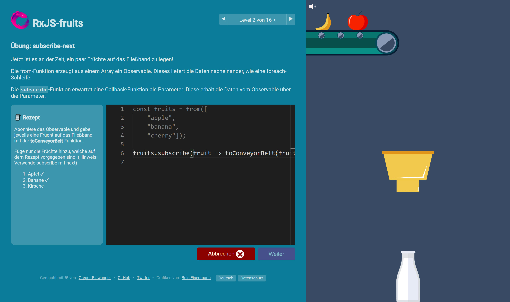

RxJS-fruits
=======

RxJS-fruits is a game for learning RxJS (Reactive Extensions for JavaScript). Check it out at [rxjs-fruits.com](https://www.rxjs-fruits.com).

## Author

Gregor Biswanger

* [Twitter](https://twitter.com/BFreakout)
* [Homepage](http://about.me/gregor.biswanger)
* [GitHub](https://github.com/GregorBiswanger)

## Sponsors

Thank you to all sponsors! 🙏

  

## Copyright and License

Copyright 2020 Gregor Biswanger. Code released under [the MIT License](https://github.com/GregorBiswanger/rxjs-fruits/blob/master/LICENSE.md). Images released under [Creative Commons](https://creativecommons.org/licenses/by/3.0/legalcode.txt).
